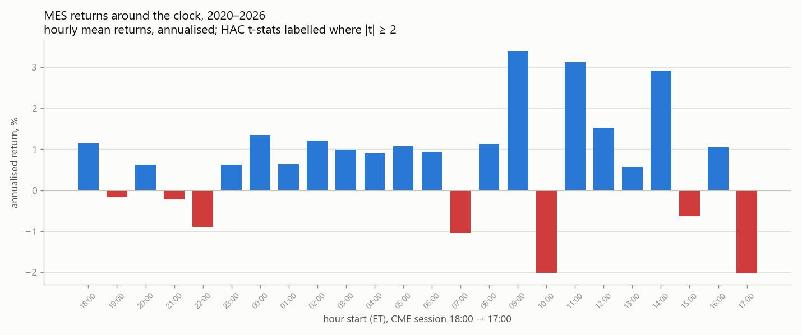
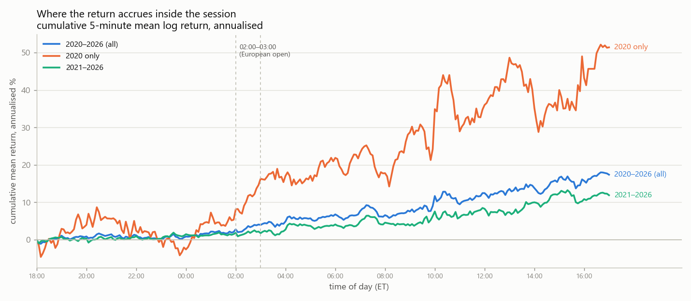
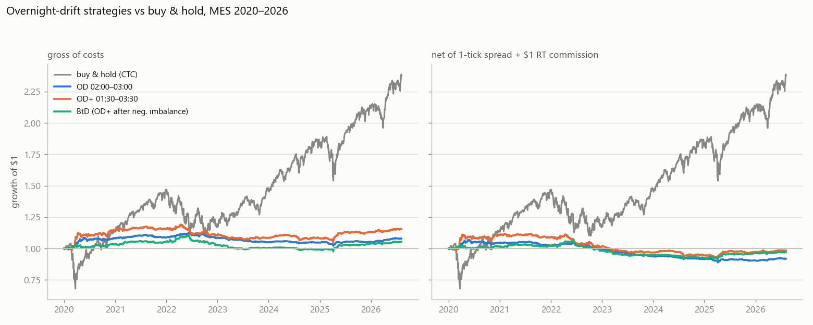
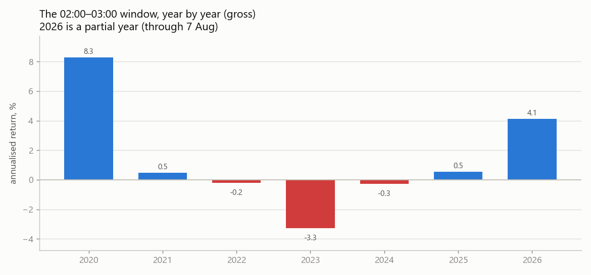
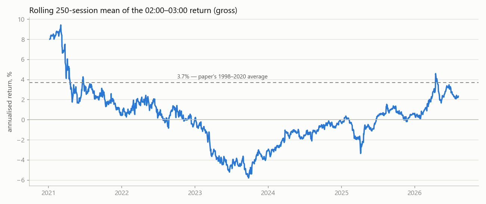
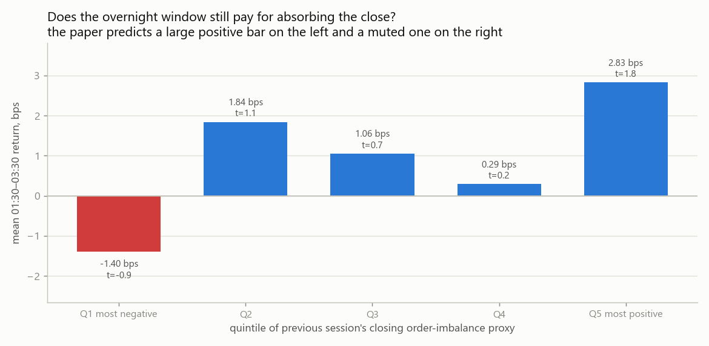
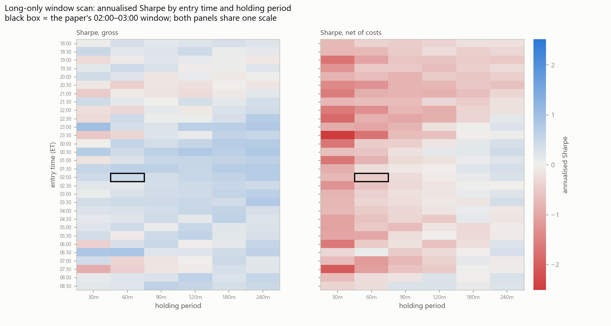

# Overnight drift on MES, 2020–2026 — out-of-sample test

Backtest of Boyarchenko, Larsen & Whelan, *The Overnight Drift* (FRB NY SR 917 / RFS 2023)
on `data/MES_5min_databento.parquet`. Script: [`mes_overnight_drift_backtest.py`](../../mes_overnight_drift_backtest.py).

The paper's sample is **1998–2020**. This dataset is **2020-01-02 → 2026-08-07** (1,618 sessions),
so apart from 2020 it is a clean out-of-sample window on the same instrument family (MES is the
micro version of the ES contract the paper studies).

## Method

- 5-minute bars, US/Eastern, CME session stamped 18:00 → 17:00.
- A bar stamped `t` covers `[t, t+5m)`, so its **open** is the traded price at exactly `t`.
  The 16:55 bar's close is carried as a synthetic 17:00 print so the last hour is measurable.
- Windows: **OD** = 02:00→03:00, **OD+** = 01:30→03:30, **BtD** = OD+ taken only after a
  negative end-of-day imbalance. Benchmarks CTC (16:00→16:00), CTO (16:00→09:30), OTC (09:30→16:00).
- Costs: one full spread per round turn (1 MES tick = 0.25 pt = $1.25) plus $1.00 round-turn
  commission. That is **0.99 bps of notional on average** over the sample (1.41 bps in 2020 when
  the index was near 3,300; 0.63 bps in 2026). Full-size ES would be 0.66 bps average.
- HAC (Newey–West) t-stats throughout; Benjamini–Yekutieli correction across the 24 hourly windows.

## Result 1 — the 02:00–03:00 hour is no longer special

| window | mean, bps/day | annualised | HAC t | p | BY-adj p |
|---|---|---|---|---|---|
| **02:00–03:00 (paper's OD)** | **0.48** | **1.21%** | **1.17** | 0.24 | 1.00 |
| 00:00–01:00 | 0.54 | 1.35% | 1.09 | 0.28 | 1.00 |
| 09:00–10:00 | 1.35 | 3.40% | 1.70 | 0.09 | 1.00 |
| 11:00–12:00 | 1.24 | 3.13% | 1.77 | 0.08 | 1.00 |
| 14:00–15:00 | 1.16 | 2.91% | 1.62 | 0.11 | 1.00 |

Paper: 1.48 bps/day, t = 7.1. Here: **0.48 bps/day, t = 1.17**. Nothing in the 24-hour grid
survives multiple-testing correction — every BY-adjusted p is 1.00. The paper's other headline
sign flips too: its 09:00–10:00 "opening hour" was −1.2 bps (t = −2.6); here it is the *largest*
positive hour in the day.

## Result 2 — the return no longer accrues at the European open

In 2020 the shape is exactly the paper's: a visible step up through 01:00–04:00. From 2021 on the
overnight session is flat and the entire close-to-close return is earned inside US hours.

## Result 3 — strategy performance

Full sample, annualised:

| | CTC | CTO | OTC | OD | OD+ | BtD |
|---|---|---|---|---|---|---|
| **gross** mean % | 15.67 | 7.36 | 8.31 | 1.21 | 2.35 | 0.87 |
| vol % | 20.47 | 13.86 | 14.75 | 2.74 | 4.44 | 3.18 |
| Sharpe | 0.77 | 0.53 | 0.56 | 0.44 | 0.53 | 0.27 |
| HAC t | 2.21 | 1.36 | 1.68 | 1.17 | 1.27 | 0.74 |
| max DD % | −34.5 | −31.9 | −16.4 | −9.2 | −11.7 | −11.7 |
| **net** mean % | 15.66 | 4.85 | 5.81 | **−1.29** | **−0.16** | **−0.39** |
| net Sharpe | 0.76 | 0.35 | 0.39 | **−0.47** | **−0.04** | **−0.12** |

Split at 2021:

| period | strategy | gross Sharpe | net mean % | net Sharpe | net t |
|---|---|---|---|---|---|
| 2020 | OD | 1.72 | +4.70 | 0.98 | 0.96 |
| 2020 | OD+ | 1.94 | +10.88 | 1.46 | 1.17 |
| 2021–2026 | OD | −0.02 | **−2.36** | −1.09 | **−2.74** |
| 2021–2026 | OD+ | 0.05 | −2.13 | −0.58 | −1.50 |
| 2021–2026 | BtD | 0.15 | −0.74 | −0.26 | −0.62 |

Post-2020 the net loss is *reliably* negative (t = −2.74) — you are paying the spread every night
for a gross edge that no longer exists. The paper's own net OD Sharpe on 2004–2020 was −0.54;
this reproduces the sign and roughly the magnitude, but here the gross leg no longer covers costs
either.

2020 alone carries the full-sample result. 2023 was the worst year (−3.3% annualised). 2026 YTD
is +4.1% (t = 2.0) — one partial year out of seven, well inside what noise produces when you look
at seven of them.

## Result 4 — the mechanism's signal does not show up

The paper's central conditional claim: overnight returns should be **large after a negative
end-of-day order imbalance** and **muted after a positive one**. Sorting OD+ returns into quintiles
of the previous session's closing imbalance gives the opposite ranking — the most negative quintile
is the only negative bucket (−1.40 bps, t = −0.9), the most positive quintile is the largest
(+2.83 bps, t = 1.8). A second imbalance definition (classic tick rule instead of bar
close-minus-open) gives the same picture, so this is not an artefact of one signing rule.

Caveat, and it is a real one: true RSV needs trade-level classification against the quote.
Both proxies here sign a whole 5-minute bar's volume, which is much coarser than the paper's
measure and will attenuate any genuine relationship. This test can show that the *proxy* has no
usable predictive content; it cannot by itself prove the underlying mechanism is gone.

## Result 5 — nothing else in the night replaces it

Scanning every entry from 18:00 to 08:30 in 30-minute steps × six holding periods (156 windows):
gross Sharpes are mostly in the ±0.5 band, and after costs almost the entire overnight grid is
negative. The handful of blue gross cells (23:00, 00:30, 06:30) are what a 156-cell search returns
by construction — no correction survives them, and none survives costs.

## Reading

The paper's fact does not replicate on 2021–2026 MES data. The 02:00–03:00 window returns
0.48 bps/day gross full-sample (t = 1.17) versus 1.48 bps/day (t = 7.1) in the paper, and
essentially zero once 2020 is excluded. Costs of ~1 bps round turn then make every version of the
trade a reliable loser. The conditional "buy the dip after negative closing imbalance" variant —
the only version that survived costs in the paper — does not work here on either imbalance proxy.

This is consistent with the authors' own 2026 follow-up (*The Disappearing Overnight Drift*),
which reports the window flat over 2021–2025 and attributes it to end-of-day imbalance dispersion
collapsing by more than half as execution algorithms slice closing orders finer. If the
compensation was for absorbing residual inventory overnight, and there is no residual inventory,
there is nothing to be paid for.

## What this test does not cover

- **Bar-level data only.** No quotes, so the cost model is an assumption (1 tick) rather than a
  measurement, and the imbalance proxies are coarse.
- **No market impact or slippage** beyond the spread, and no queue/fill modelling. A passive
  version that *earns* the spread instead of paying it is the interesting variant and cannot be
  tested without book data.
- **No financing/roll drag** on CTC — the buy-and-hold benchmark is the raw futures price series,
  which understates the cost of the passive leg slightly.
- **2020 is in-sample** relative to the paper (its data ends December 2020), so the honest
  out-of-sample statement is the 2021–2026 row, not the full-sample row.
- Single instrument, single index. The paper's mechanism predicts analogues in other 24-hour
  futures; not tested here.

## Files

| file | contents |
|---|---|
| `hour_profile.csv` | all 24 hourly windows: mean bps, annualised, t, p, BY-adjusted p |
| `strategy_stats.csv` | full-sample stats for all six strategies, gross and net |
| `subsample_stats.csv` | same, split 2020 vs 2021–2026 |
| `od_by_year.csv` | OD / OD+ / CTC by calendar year |
| `imbalance_sort_bar.csv`, `imbalance_sort_tick.csv` | quintile sorts under both signing rules |
| `window_scan_sharpe_gross.csv`, `window_scan_sharpe_net.csv` | 156-window entry × duration scan |
